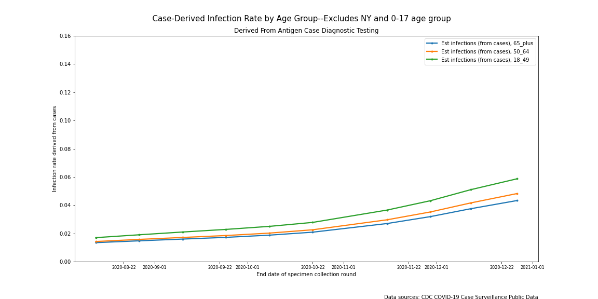
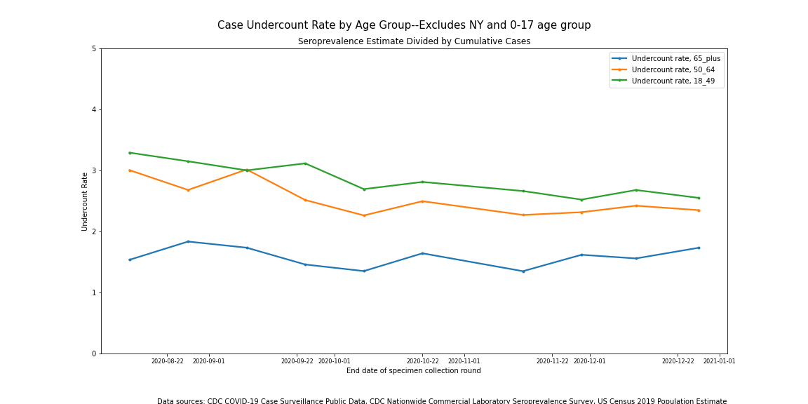

# How much are we undercounting COVID-19 cases? 
## Comparing seroprevalence testing to case diagnoses

</img>
</img>

The two charts to the right are time series measures of the percent of the population that has been infected with COVID. The top chart to the right shows a time series of cumulative positive COVID case diagnoses throughout the United States for four separate age groups. The case count numbers are assumed to be a proxy for actual infections and they are widely reported by the media and monitored regularly by public health agencies and government officials. Numerous studies, however, point to substantially more people being infected with COVID-19 than diagnosed. The bottom chart displays a time series estimate of the percent of the population that has tested positive for the presence of antibodies--a robust indicator of prior COVID infection. These estimates are likely to more accurately reflect the true scope of COVID infection in the United States. 

The charts share the same x scales and y scales. The substantial difference between the two provides a sense of how much case diagnoses undercount actual infections. This article will explore the usefulness of using the seroprevalence dataset that went into the bottom chart to estimate actual COVID infections from case counts. We will start by considering the strength and the limitations of the data that feed into these two charts. 

### *Measuring cases*
Every day thousands of people across the country are tested for active COVID infections. The results of these immunoassay tests are compiled and used by governments and public health agencies to determine policy. They are reported by news organizations across the country. Underlying the use of these data is the assumption that the aggregation of these tests is a good baromater of the scope of COVID infection in the broader population. 

What is usually missing from the reports of the COVID case data is an acknowledgement that these numbers are just a sample of the total number of active COVID infections. Most of the positive tests come from people who have self-selected to receive a test because they are exhibiting symptoms. This testing scheme misses many people who are infected with COVID but who are asymptomatic or mildly symptomatic. This contributes to the undercount rate indicated above. (The self-selection aspect of the COVID diagnostic case sample is just one example of its non-random, uncontrolled nature. The lack of statistical design of the COVID sample leads to other issues not considered here. For further discussion of this topic [visit here]()).

There is yet another limitation with the case undercount rate over time. It hasn't been consistent. Antigen testing--the technology typically used to diagnosis COVID infections--shortages were acute in the early phase of the pandemic. The antigen test shortage was significant, but temporary. The shortages were addressed by mid summer 2020. Prior to that, numerous people went undiagnosed because they couldn't get tested.

Notwithstanding the shortcomings in the case counts listed above, the sample of case counts is *large* and it is *timely.* It has been an incredibly useful tool.

### *Measuring prior infections*
Researchers recognized early on that many more people were likely infected than positively diagnosed. Several turned to seroprevalence (blood serum) tests of antibodies as a way to measure the actual COVID infection prevalence. Antibodies are detectable after the immune system generates a response to the presence of the virus. Seroprevalence tests aren't good diagnostic tests since antibodies usually aren't detectable until the infection is well underway, but antibodies will stay in the blood for many months to ward off reinfection, so they are considered to be a good indicator of a previous COVID-19 infection in an individual. They are considered to be a better measure of COVID-19 prevalence in a population than the cumulative sum of positive diagnostic antigen tests. 

One published study using data from 28,503 blood samples collected in the US in July, 2020 estimated about ten infections for every one diagnosis ([1](https://www.thelancet.com/journals/lancet/article/PIIS0140-6736(20)32009-2/fulltext)). A similar undercount rate based on seroprevalence was obtained by researchers looking at a large sample of the Australian population ([2](https://academic.oup.com/jid/advance-article/doi/10.1093/infdis/jiaa623/5917625)). 

The CDC has made available another--much larger, more representative, and more current--set of seroprevalence data than the July dataset. Since August, the CDC has partnered with blood-testing labs across the US to conduct a secondary analysis for COVID-19 antibodies in a selection of the blood samples that the labs receive in the course of their business. A sample of 40,000-50,000 blood samples is selected and analyzed every two weeks. Each biweekly sample is stratified by state and by age group so that they can aggregate statistics for each state with reasonable confidence. The resultant statistics are published to the CDC website within a few weeks of the sample being drawn. More information about this study can be found in this [publication](https://jamanetwork.com/journals/jamainternalmedicine/fullarticle/2773576) and on the [webpage](https://covid.cdc.gov/covid-data-tracker/#national-lab) that the CDC maintains for the study.

### *Analysis by State*
The CDC seroprevalence data provides a large, geographically comprehensive, and ongoing measure of actual COVID infections. Notwithstanding all of the caveats that the authors place on these data, they publish an estimated COVID-19 infection rate for every state for every two-week sample time period (except for states with limited data like North and South Dakota). They also publish a cumulative case count for each state based on antigen testing for the same time period, so calculating an undercount rate is simply a matter of dividing the two. The following very busy chart puts all of these data together and plots the undercount rates for all states for all time periods.

</img>

There are two things to note in this chart. First, the undercount rates tend to decrease as time progresses. This is due to the effect of the early testing shortage on the undercount being diminished as more cases are added to the total. Second, in all but two state/time periods, the undercount rate is below ten--usually much lower than ten. This raises the question of how to reconcile these data with the undercount rate calculated in the other US-based seroprevalence study. 

The authors of the above-mentioned publication of this large seroprevalence dataset did not attempt to calculate an undercount rate or use the data to for any national statistic based on seroprevalence. They pointed to the limitations of the study design and the fact that some of the stratifications had insufficient data. While this is true, there are a lot of data in this dataset, and estimates derived from it may be the best available. We are going to generate some population-weighted average statistics and see if those numbers make sense. They may not be definitive, but they may put us in the ballpark. If so, they could have a number of uses--even if there are not statistically definitive.

But first things first. Let's take another look at the data that feeds into the previous chart. Let's compare the growth in estimated infections from seroprevalence data to the growth in cumulative cases for each state. Ideally the growth rates would be well-correlated. After all, they're based on the same underlying random variable--actual cumulative COVID infections.  Is there some consistency to the slope of the estimated infection time series divided by the slope of the cumulative cases time series?

</img>

Most of the data is normally distributed, but there is one extreme outlier. That outlier happens to be New York. The chart below displays the two components of the undercount rate time series for New York--the infection rate from seroprevalence data and case counts.

</img>

The infection estimate from the seroprevalence data from New York is actually *decreasing* which you can see in the chart below. Clearly something is up with these data. Actually, at least two things may be impacting the New York state seroprevalence numbers over time. One is that an additional laboratory was brought online to process the New York data beginning in November. This change coincides with a big decrease in the New York state infection estimate based on seroprevalence. The new lab may be drawing from a different population within state. Its testing method may have different levels of sensitivity and specificity. Another potential data issue relates to the length of time that antibodies stay in the bloodstream at detectable levels post-infection. After a while, the level of antibodies in the blood post-infection may fall off to levels that seroprevalence tests can no longer detect. Whether it's one of these factors, both of them, or something else entirely, something is not right with the New York seroprevalence results.

### *Analysis by Age Group*
Let's now take a look at a population-weighted average of the seroprevalence numbers by age group over time.

</img>

There are a couple of things to point out about this chart. For the most part, the time series behave as one would expect. Seroprevalence increases predictably over time for each age group with a normal range of variation. One observation stands out. The fourth time period for the '0-17' age group seems to be an outlier. That's not the only one. The first two time periods for that age group also seem to be high relative to the others age groups. Is there something going on with this set of data? The following table shows that this group has a much higher rate of insufficient data than the others. Forty-three percent of state/time periods have insufficient data. The rest are under 8%. 

| State/time period insufficient data by age group  |
| :: | 

| Age group | Percent |
| :---: | :---: | 
| '0-17'  | 43 %  |
| '18-49' | 6 %  |
| '50-64' | 7 %  |
| '65+'   | 8 %  |

So, we have an issue with the New York data and with the '0-17' age group. I don't see any easy fixes to these data so we are just going to have to set them aside. Let's recreate the cumulative cases chart and the seroprevalence chart setting aside the New York data and the 0-17 age group.

</img>

</img>

As expected, removing New York has changed the population-weighted means, but the time series look similar to what they were before. Although New York is a large state, the 49 other sites (states and territories) add stability to the numbers.

Let's now take a look at the *undercount rate* by age group over time period.

</img>

The time series for two of the three age groups decrease noticeably over time. This is not surprising. As was mentioned before, the primary reason for the decrease is that the effect of the early testing shortage on the undercount rate diminishes as more cases are added to the total.

Let's take a look at the average undercount rate by age group for August alone.

</img>

The fact that the test shortage issue was most acute early on and diminishes over time implies that undercount rate *prior* to August was almost certainly higher than the point estimates in this chart. In addition to that, we excluded data from New York--the state that experienced the worst of the early outbreak and thus likely had a high undercount rate from testing shortages.

For all age groups, the undercount rate point estimate for August ranged from 1.5 - 3.3. As one would expect, these estimates are in line with the state-level data from the prior section, but hard to reconcile with the 10x undercount rate calculated from the other US-based seroprevalence data from July. It may be that the labs used tests with different sensitivities. Both datasets were adjusted to reflect the broader population, but it may also be that these adjustments are inconsistent.

Let's take a look at the average undercount rate by age group for December.

</img>

The December undercount rate ranges from slightly under 2 for the older age group, to slightly under 3 for the other two age groups. It bears mentioning again that the ability to detect antibodies post infection decreases over time. At some point the seroprevalence estimate will no longer be a good estimate of all prior infections.

On January 15, 2021, the CDC published an estimate of 4.6 infections (C.I. 4.0-5.4) for every 1 reported case of COVID through Decmber 2020 ([CDC COVID burden estimate](https://www.cdc.gov/coronavirus/2019-ncov/cases-updates/burden.html#anchor_1607017301754)). This rate had recently been revised downward in light of new data, but it is well above the undercount rate calculated from this population-weighted dataset that excludes New York and the 0-17 age group. 

### *Discussion*

The CDC publishes an estimated COVID infection rate for every state based upon results from a large, geographically comprehensive, and ongoing seroprevalence study. This datset seems like an ideal source for measuring the rate at which COVID infections are being undercounted in the reported case counts. 

My analysis uncovered a couple of significant shortcomings in the seroprevalence data. When this data was removed, the remaining data appears reasonable. It does not compare well with other published sources though. In particular, the estimated undercount rate based upon the seroprevalence data is lower than prior published data, and lower than the estimate that the CDC publishes on their website. 
