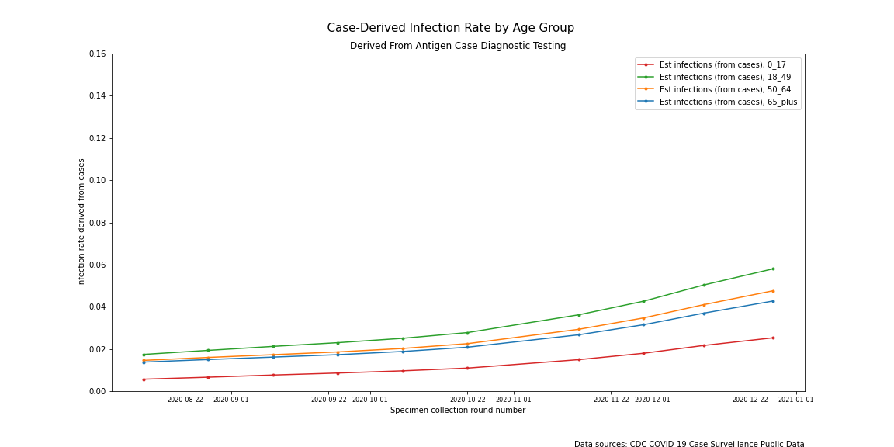

# How much are we undercounting COVID-19 cases? 
## Comparing seroprevalence testing to case diagnoses

</img>

The chart to the right shows cumulative positive COVID case diagnoses throughout the United States for four separate age groups. The case count numbers are assumed to be a proxy for actual infections and they are widely reported by the media and monitored regularly by public health agencies and government officials. Numerous studies, however, point to substantially more people being infected with COVID-19 than diagnosed. Can we tell how much the count of positive diagnoses undercounts actual infections?

Two well-known factors have contributed to the undercount rate since COVID-19 began. Antigen testing--the technology typically used to diagnosis COVID infections--shortages were acute in the early phase of the pandemic. The antigen test shortage was significant, but temporary. The shortages were addressed by mid summer 2020. Another known--and ongoing--factor contributing to undercounting is that antigen testing programs focus mostly on testing symptomatic patients and may miss people who are mildly symptomatic or asymptomatic.

Most of the large-scale measures of undercounting rely on the comparison of the results of seroprevalence (blood serum) tests for antibodies to the cumulative sum of diagnosed COVID-19 cases (via saliva or mucus membrane antigen testing) in that same population. Antibodies are detectable after the immune system generates a response to the presence of the virus. Seroprevalence tests aren't good diagnostic tests since antibodies usually aren't detectable until the infection is well underway, but antibodies will stay in the blood for many months to ward off reinfection, so they are considered to be a good indicator of a previous COVID-19 infection in an individual. They are considered to be a better measure of COVID-19 prevalence in a population than the cumulative sum of positive diagnostic antigen tests. One published study using data from 28,503 blood samples collected in the US in July, 2020 estimated about ten infections for every one diagnosis ([1](https://www.thelancet.com/journals/lancet/article/PIIS0140-6736(20)32009-2/fulltext)). A similar undercount rate was obtained by researchers looking at a large sample of the Australian population ([2](https://academic.oup.com/jid/advance-article/doi/10.1093/infdis/jiaa623/5917625)). At least for the US-based study, such large rates of undercounting from the early phase of the pandemic aren't surprising given that that was when antigen testing shortages were most severe, thus leaving a large number of infected people with no means of diagnosis.

The CDC has made available another--much larger, more representative, and more current--set of seroprevalence data. Since August, the CDC has partnered with blood-testing labs across the US to conduct a secondary analysis for COVID-19 antibodies in a selection of the blood samples that the labs receive in the course of their business. A sample of 40,000-50,000 blood samples is selected and analyzed every two weeks. Each biweekly sample is stratified by state and by age group so that they can aggregate statistics for each state with reasonable confidence. The resultant statistics are published to the CDC website within a few weeks of the sample being drawn. More information about this study can be found in this [publication](https://jamanetwork.com/journals/jamainternalmedicine/fullarticle/2773576) and on the [webpage](https://covid.cdc.gov/covid-data-tracker/#national-lab) that the CDC maintains for the study.

Notwithstanding all of the caveats that the authors place on these data, they publish an estimated COVID-19 infection rate for every state for every two-week sample time period (except for states with limited data like North and South Dakota). They also publish a cumulative case count for each state based on antigen testing for the same time period, so calculating an undercount rate is simply a matter of dividing the two. The following very busy chart puts all of these data together and plots the undercount rates for all states for all time periods.

</img>

There are two things to note in this chart. First, the undercount rates tend to decrease as time progresses. This is due to the effect of the early testing shortage on the undercount being diminished as more cases are added to the total. Second, in all but two state/time periods, the undercount rate is below ten--usually much lower than ten. This begs the question, if the undercount rate for nearly every time time period and state point estimate is below--well below--ten, then what *is* the undercount rate? 

The authors do not attempt to calculate this statistic or any national statistic based on seroprevalence. They point to the limitations of the study design and the fact that some of the stratifications have insufficient data. While this is true, there are a lot of data in this dataset, and estimates derived from it may be the best available. We are going to generate some weighted average statistics and see if those numbers make sense. They may not be definitive, but they may put us in the ballpark. If so, they could have a number of uses--even if there are not statistically definitive.

But first things first. Let's take another look at the data that feeds into the previous chart. Let's compare the growth in estimated infections from seroprevalence data to the growth in cumulative cases for each state. Ideally the growth rates would be well-correlated. After all, they're based on the same underlying random variable--actual cumulative COVID infections.  Is there some consistency to the slope of the estimated infection time series divided by the slope of the cumulative cases time series?

</img>

Most of the data is normally distributed, but there is one extreme outlier. That outlier happens to be New York. The infection estimate from the seroprevalence data is actually *decreasing* which you can see in the chart below. Clearly something is up with these data. 

</img>

Let's now take a look at the nationwide weighted average of the seroprevalence numbers by age group over time.

</img>

There are a couple of things to point out about this chart. For the most part, the time series behave as one would expect. Seroprevalence increases over time for each age group. One observation stands out. The fourth time period for the '0-17' age group seems to be an outlier. That's not the only one. The first two time periods for that age group also seem to be high relative to the others age groups. Is there something going on with this set of data? The following table shows that this group has a much higher rate of insufficient data than the others. Forty-three percent of state/time periods have insufficient data. The rest are under 8%. 

| State/time period insufficient data by age group  |
| :: | 

| Age group | Percent |
| :---: | :---: | 
| '0-17'  | 43 %  |
| '18-49' | 6 %  |
| '50-64' | 7 %  |
| '65+'   | 8 %  |

So, we have an issue with the New York data and with the '0-17' age group. I don't see any easy fixes to these data so we are just going to have to set them aside.

</img>
Let's now take a look at the undercount rate by age group over time. 

</img>

**undercount rate through October**
Why stop there? We'll get to that in a moment. 

Ok, why did we stop there? What's going on with New York? Seroprevalence rates start to fall. We're probably looking at the tests no longer being able to detect antibodies in those people who had infections early on in the outbreak. If we use these data to estimate the prevalence of COVID infections in a population then we are going to have data integrity issues. Unfortunately, this is exactly what the CDC does with their data on their website. Their data even includes confidence intervals which clearly don't make sense. 

Finally, it looks like the use of seroprevalence as a useful estimate of infection prevalence may have a time limit. Although the authors point out that the study is not designed to look at how long COVID antibodies stay in the bloodstream, the results may be limited by the fact that their detectability--at least according to the testing methods used in this study--falls off over time. 

The published analysis from these data indicate an undercount rate much lower than ten times. The researchers who designed the collection of the seroprevalence data and who have published results have not calculated an overall undercount rate for the entire US citing limitations of the study design, but the CDC website for the study does publish state-level data. At the state level they publish an estimate of the number of infections derived from seroprevalence with 95% confidence interval and the total number of cases reported. An estimate of the undercount rate can be derived from there.

None of the undercount rates 

The primary team of investigators who have been analyzing the seroprevalence data published findings from data gathered through September, 2020 ([3](https://jamanetwork.com/journals/jamainternalmedicine/fullarticle/2773576)). The main objective of the study was to determine the proportion of people in every jurisdiction (the states plus Puerto Rico and the District of Columbia) that had detectable levels of antibodies.  They purposefully avoided calculating a nationwide measure of seroprevalence because their study was not designed to look for that. Nevertheless, the data that the researchers released--which has been increased by the addition of several more months of data--can be useful as a preliminary analysis 

This article seeks to update some of the previous research that had been done to measure how many actual COVID-19 infections there are for every positive case diagnosis in the United States.  Previous research utilizing data just from the early phase of the outbreak when testing shortages were still widespread reported an undercount rate as high as ten infections for every one positive diagnosis. Much more data are now available. These data make further analysis possible including the potential to remove the effect of the undercounting due to test kit availability in the early phase of the pandemic so that the ongoing undercount rate due to missing mildly symptomatic or asymptomatic individuals can be isolated.

A simple analysis suggests that there are about two actual infections for every one positive case diagnosis today. Unfortunately, it's impossible to draw valid statistical bounds around this number as there are too many data integrity issues with both the numerator--actual infections as estimated by antibody seroprevalence testing--and the denominator--daily case counts as determined by a antigen testing of mostly symptomatic individuals.

All is not lost though. This article wraps up with a discussion section which explores these data integrity issues in more detail. The data integrity discussion leads to an interesting idea which is introduced here and explored more fully in another article. The weak undercount statistic that is calculated here may actually prove useful in that idea.

