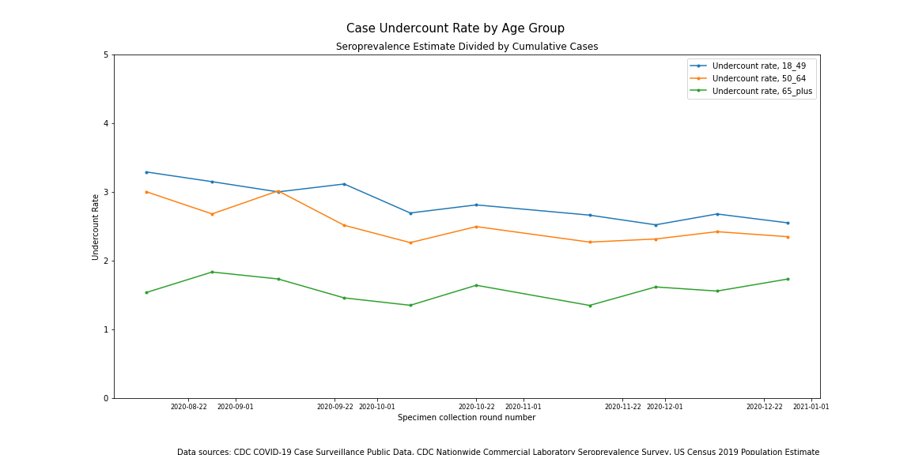
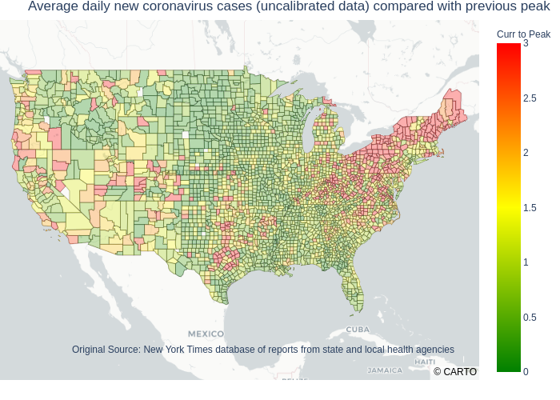
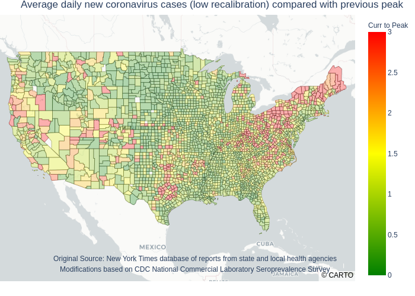
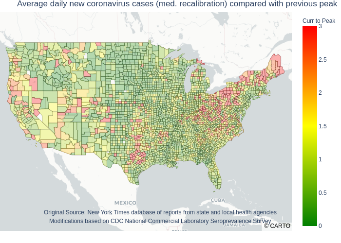

# A common data integrity issue in widely available COVID-19 case data
## Proceed with cauth when making time period comparisons

</img>

One of the most common metrics used to monitor the COVID-19 pandemic in this country is the tally of daily antigen case diagnoses. One thing that is usually missed in the reporting of this metric is that it is a sample of total active COVID infections--not the complete picture. It undercounts actual COVID infections. 

This sample has some data integrity issues which are frequently overlooked. One of those data integrity issues is that the undercount rate has varied over the course of the pandemic. This article is going to explore how the lack of awareness of this particular data integrity issue can lead to analytical issues. 

It was apparent from the outset of the pandemic that active infections were being undercounted. The CDC was unable to quickly respond to the need for antibody testing capacity and for collecting the data from the tests that were being administered. The problems were so acute that organizations that were not normally involved in either line of work stepped in to try to fill the void. University research labs added testing capacity. News organizations like the New York Times and The Atlantic stepped in to collect and compile case diagnosis data from public health agencies into a national database--which they continue to do. Notwithstanding these tremendous civic efforts, many cases went undiagnosed. The following cautionary message has been on the [New York Times github page](https://github.com/nytimes/covid-19-data) since the early days of the pandemic, "*Because of the widespread shortage of testing, however, the data is necessarily limited in the picture it presents of the outbreak.*" 

The testing capacity issue was largely solved as summer began in 2020. This does not mean that the undercount rate went to zero. Fairly early on it became clear that there was another contributing factor to undercounting. Some people could be silent carriers of COVID who exhibited no symptoms or only mild symptoms. These people were unlikely to be detected by the COVID testing programs. The net result of this is that the undercount rate has varied--significantly--over time. As a result, comparisons of case counts between the early phases of the pandemic and later may not be accurate.

How many cases were missed in the early phase of the pandemic? One published study using data from 28,503 blood samples collected in the US in July, 2020 estimated that there may have been as many as ten infections for every one diagnosis ([1](https://www.thelancet.com/journals/lancet/article/PIIS0140-6736(20)32009-2/fulltext)). I didn't find a rate quite that high in a larger dataset of blood sample data supplied by the CDC, but [my analysis]() did show how the undercount rate decreased over time. The chart at the lead-in to this article comes from this analysis.

How can these early data integrity issues affect comparisons across time periods? Recently (Sunday, February 7, 2021), the New York Times published a chart comparing the average daily new COVID-19 case count by county compared to that county's previous peak. I believe the purpose of the chart was to show which parts of the country were worse off as of February 6, 2021 than during prior peaks. Some of the peaks being used for comparison occurred during the spring of 2020 when undercounting for the reasons mentioned above was most acute. 

For illustrative purposes, I recreated the New York Times chart (continental US only). That's the first of the four charts below. The other three charts use the same set of data except that the case counts prior to June 1, 2020 have been increased to try to correct for the temporal data integrity issue described above. The assumptions that feed into the charts with the recalibrated data come from [my analysis mentioned above](). This analysis has its own set of limitations, so the recalibrations are only educated guesses. Hence, I made several charts to show a range of possibilities ranging from a low rate of recalibration (counts prior to June 1, 2020 were increased about 2x compared to the rest) to a high rate of recalibration (counts prior to June 2, 2020 were increased 3.5x).

    </img>
    </img>

 

    </img>
    </img>

 

All four charts are comparable throughout most of the US except in the northeast--the area that experienced the worst of the early outbreak. More of the northeast is red in the first chart than it is in the other charts. The reason for this is that each county's color is determined by comparing the current daily case count (as of February 6, 2021) to the prior peak. The counties that shifted from red in the first chart to green in the others were the ones that had their peak rates calibrated upwards to try to correct for the undercounting that was occurring at the time. The effect on the charts is that less of the northeast appeared to be experiencing its most significant outbreak on February 6, 2021--the reference date.

Which is these charts is correct? Possibly none of them. The undercount data integrity issue is not easily addressed. The major takeaway is that time period comparisons using the COVID-19 case data ought to be done with caution. 

This isn't the only data integrity issue related to undercounting lurking in the daily case data. Nor is it the most important. Public health agencies and governments are relying on daily case counts as one of the most important metrics to monitor the spread of COVID in their communities. Could further data integrity issues with regards to undercounting be impacting their ability to understand important changes in a timely manner? This topic is explored in a [separate article]().